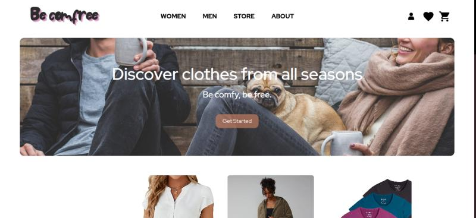

# Be-Comfree:

**_Be-Comfree_** es un e-commerce orientado al rubro de la moda, nos caracterizamos por el glamour y la buena estetica, si buscas **_prendas_** de alta costura **_No busques mas_** te garatizamos productos de excelente calidad compañado de precios realmente competitivos.

Dentro del catalogo puedes encontrar:

- Pantalones, vestidos, sacos, remeras,prendas intimas y muchos mas.

# PF:

El **Proyecto Final** es una instancia evaluativa grupal dentro del BootCamp FullStack _SoyHenry_, donde se fortalece la cretividad, los conocimientos técnicos y las habilidades blandas a través de la creación de una aplicación compuesta por cliente y servidor.

Las tecnologias utilizadas son las siguientes:

- Front-end (Client):

  - React
  - Zustand
  - Axios
  - TailwindCSS

- Back-End (Server):
  - Express
  - Axios
  - Sequelize
  - PostgreSQL
  - API:
    - Json de Productos
    - Cloudinary
    - PayPal

## Integrantes del grupo:

### Back-End:

- <a href="">Alma Cane</a>, <a href="https://www.linkedin.com/in/yonathan-ponce/">Yonathan Ponce</a>, <a href="https://www.linkedin.com/in/ezesarru/">Ezequiel Sarruger</a> y <a href="https://www.linkedin.com/in/franco-adolfo-bottaro/">Franco Bottaro</a>

### Front-End:

- <a href="">Brenda Baumann</a>, <a href="https://www.linkedin.com/in/irma-nohemi-solis-loyo/">Nohemi Solis</a>, <a href="https://www.linkedin.com/in/jerry-murillo/">Jerry Murillo </a> y <a href="">Oswaldo Palacios</a>.

 

  

